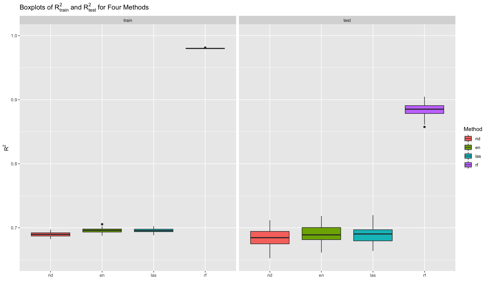
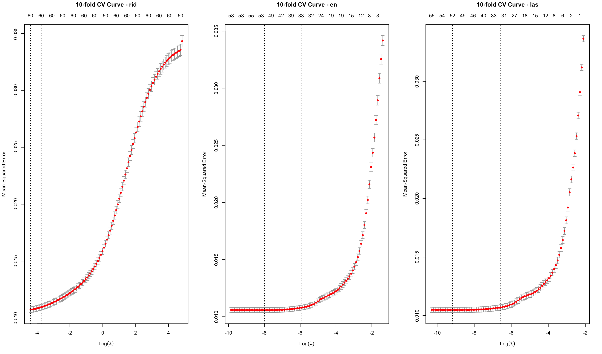
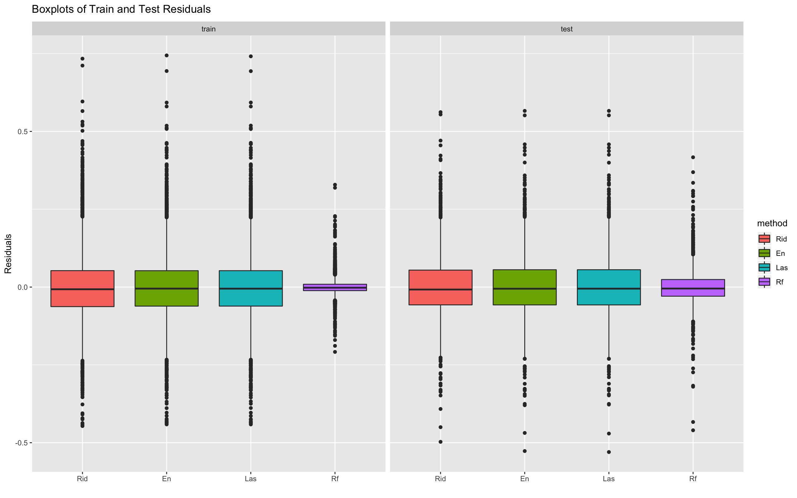
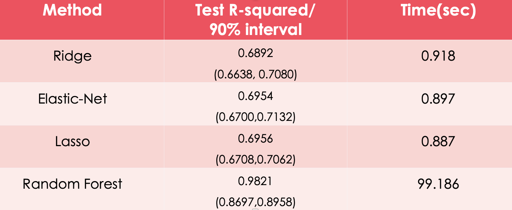
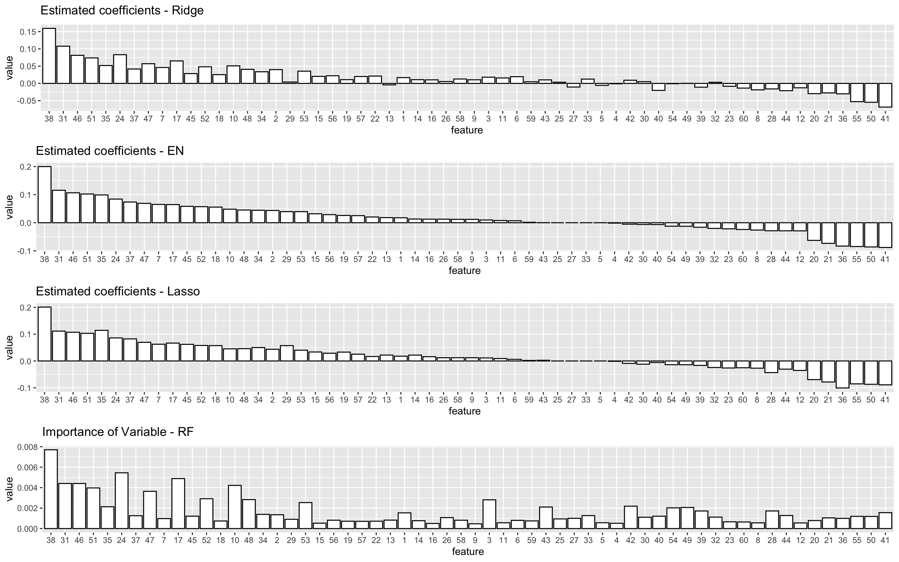

# STA9890 - Statistical Learning for Data Mining Final Project

											Yen-Ching, Lin

This project leads us using 4 different statistical learning techniques to do regression analysis in R. 

## Data Description
The dataset of this project is derived from the Trading Agent Competition in Supply Chain Management.

The number of observations ***n = 8,966***.

The number of predictors ***p = 61***. 

There is no categorical variables, all variables are numeric. There is no missing values.

The response is the mean price of product for 20days in the future. The features includes some statistics of product, such as the price in specific day, historical price, stock keeping units, storage cost, etc.

The dataset can be found on openML website.

Data source: [scm20d] (https://www.openml.org/d/41486)

The target is to predict the future price of product by 4 different methods: 

1. Ridge 
2. Elastic-Net
3. Lasso
4. Random Forest

We randomly split the dataset into the train and test subset. The sample size of train set is 80% of observations. The test set included the rest of the observations. We then fit the model by 4 different methods 100 times.

## SIDE-BY-SIDE BOXPLOTS OF R2
After Tuning the λs using 10-fold CV 100 times for all 4 models, the side-by-side boxplots of R2 are shown below, we can see that the R2 for ridge, elastic-net and lasso are about **0.69** in both train and test set. The R2 for random forest is about **0.98** in train set and **0.88** in test set.

The variance of R2 are much bigger in test set than in train set for all 4 methods.This might be due to the sample size of train set is 4 times of the test set.  

## 10-FOLD CV CURVES
From the 10-fold cv curves plot below, we can see that the mean square error increased while the lambda increased in all three models.

For the optimal elastic-net and lasso, there are **52** non-zero coefficients. While the ridge takes all **60** variables since ridge does not have the ability to do variable selection.

The runtime for elastic-net and lasso are similar, both takes around 0.9 secs, while the ridge takes 0.5 secs.

## SIDE-BY-SIDE BOXPLOTS OF RESIDUALS
The mean of residuals are about **0** for all methods in both train and test sets.
The residual variance of random forest is much larger in the test set than in the train set.

## PERFORMANCE AND RUNTIME
The table below summarize the model performance and the runtime to fit model with 10-Fold CV using ebtire dataset. The 90% test R2 interval comes from the results of 100 samples above. 

We can see that the test R2 fall into the 90% R2 interval for ridge, elastic-net and lasso. The test R2 are very close for these three methods. The run time to fit ridge, elastic-net and lasso are about **0.9** secs. The random forest has better performance than three other methods, the test R2 is about **0.98**, the 90% interval is from **0.86** to **0.89**. Nonetheless,  it takes **99** secs to fit random forest model. We may conclude that there is a trade-off between the training time and model performance.

## BARPLOTS OF ESTIMATED COEFFICIENTS 
The figure below shows the barplots of **ESTIMATED COEFFICIENTS** for each model.

The the most important variable with positive coefficient in all 4 models:

* Sku1 (stock keeping unit 1)

This might be due to there are storage cost for vendors. In order to reduce the storage cost, the vendors will increase the inventories only when they expect the price will goes up in the coming days.

The the most important variable with negative coefficient in ridge and elastic-net:

* Sku12 (stock keeping unit 12)

The the most important variable with negative coefficient in lasso:

* compidx12it30 

This might be due to there is a cycle in demand and supply, and the cycle period is 12 days. Since this dataset did not provide full description of features in detail, the insight for the negative coefficient variables is just a guess.

## CONCLUSION

* Random forest performed better than Ridge, Lasso and Elastic-Net in both train and test datasets
* Trade-off between accuracy and fitting time
